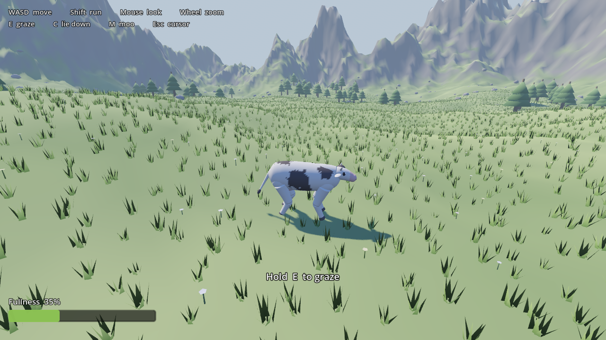

# Cow Simulator

You are a cow. You live on a wide alpine plain ringed by snow-capped mountains.
You walk, you eat the grass, and you moo about it.

That is the entire game right now, and proving that much is the point — this is a
playable vertical slice, not a demo of a finished game. See [DESIGN.md](DESIGN.md)
for where it goes next and [STEAM.md](STEAM.md) for what shipping it actually costs.



## Running it

Needs **Godot 4.7.1** (or any 4.4+). No other dependencies, no addons, no asset packs.

```powershell
winget install --id GodotEngine.GodotEngine -e
```

Then either open `project.godot` in the Godot editor and press **F5**, or run it
straight from the command line:

```powershell
godot --path .
```

The world is generated at startup — terrain mesh, collider and ~27,000 grass tufts —
which takes roughly half a second and prints a line to stdout when it is done.

## Controls

| Input | Action |
|---|---|
| `W` `A` `S` `D` | Walk (camera-relative) |
| `Shift` | Run |
| Mouse | Orbit camera |
| Mouse wheel | Zoom |
| `E` (hold) | Graze — only works standing still, on grass |
| `C` | Lie down / get up |
| `M` | Moo |
| `Esc` | Release / recapture the mouse cursor |

A gamepad is mapped too (left stick, A to moo, B to run, X to graze), but the
camera is mouse-only for now.

## What actually works

- **Procedural world.** Rolling plains in the middle, a ring of ridged mountains
  with snow caps and rock faces, and low passes cut through the ring so it reads as
  a valley rather than a bowl. One height function drives the render mesh, the
  trimesh collider, the grass scatter, the spawn point and the camera's ground clamp,
  so none of them can disagree about where the ground is.
- **Cow controller.** `CharacterBody3D` with weighty acceleration, slope handling up
  to 57°, and camera-relative steering.
- **The legs actually walk.** Four two-bone IK chains on a lateral-sequence
  footfall — the order a real cow uses, back-left leading — with a 0.66 duty
  factor. The cycle advances by *distance travelled*, not by time, which is what
  stops the hooves ice-skating: if the body hasn't moved, the cycle hasn't
  advanced. A planted hoof is pinned to the exact world position it landed on
  until it lifts, and body height, pitch and roll are derived from where the
  four hooves ended up rather than from a sine wave. Standing still, a hoof that
  drifts too far from under its hip steps back on its own, so turning on the
  spot is a shuffle rather than a pivot on locked feet.
- **Cow things.** Tail sways and occasionally flicks, with phase lag down the
  joints so it whips instead of sweeping rigidly. Ears twitch. She blinks. She
  chews while grazing and ruminates in bouts when idle, and glances around when
  standing still. None of it is locked to the stride — anything that beats in
  time with the walk reads as machinery.
- **Lying down** (`C`). The barrel sinks and the hooves draw in under her, and
  the two-bone IK folds each leg on its own because the hip-to-hoof distance has
  collapsed — there is no authored lying-down pose anywhere. She settles onto one
  hip and ruminates almost continuously, which is what a resting cow is really
  doing. Asking her to walk always overrides it.
- **Scenery.** Conifers in noise-driven groves rather than an even sprinkle,
  scree gathering toward the foothills, and flowers through the meadow — three
  MultiMeshes, so the whole lot is three draw calls. The grass sways on a vertex
  shader, phase-offset by each tuft's world position, because a field that
  breathes in unison reads as a bug.
- **The cow itself** is generated at runtime from lofted tubes — a path, a radius
  per station, a swept ring — rather than assembled from box and cylinder
  primitives. Markings are vertex colours evaluated against noise-warped blobs, so
  they wrap the body instead of sitting on it as flat plates. Stylised is fine;
  a crate on sticks is not.
- **Grazing.** Hold `E` and the head drops. Individual tufts within reach are chewed
  shorter and disappear; the fullness meter fills by exactly what was consumed. A
  patch runs out in about a second, so the loop is *stop, eat, move on* rather than
  hold-to-win. Eaten tufts regrow after 35 seconds. Fullness drains slowly, so
  standing still forever is not a strategy.
- **Moo.** Synthesised at runtime — a pitch contour through a sweeping lowpass —
  so the project ships with zero audio files. Bound to `M`, with a visible ring
  so it reads on a screenshot or a GIF.

## What is deliberately not built

No menus, no save system, no achievements, no settings screen, no art pipeline,
no herd, no predators, no weather. Those are all named and argued about in
[DESIGN.md](DESIGN.md). The slice exists to answer one question — *is being a cow
on a mountain worth building?* — before any of that gets paid for.

## Layout

```
project.godot          input map, window and renderer config
scenes/
  main.tscn            world root: environment, sun, terrain, grass, cow, camera, HUD
  cow.tscn             the cow — collision capsule, neck pivot, moo audio + ring
  hud.tscn             fullness bar, graze prompt, control hints
scripts/
  game.gd              owns build order: terrain -> grass -> cow -> camera
  mountain_terrain.gd  height function, mesh + collider generation, spawn search
  grass_field.gd       MultiMesh tufts, spatial-hash grazing queries, regrowth
  cow.gd               movement, grazing, fullness, moo
  cow_model.gd         builds the cow rig from lofted tubes at runtime
  cow_gait.gd          four-leg IK walk, footfall timing, body pose from feet
  cow_life.gd          tail, ears, blinking, chewing, idle glances
  scenery.gd           trees, rocks and flowers, three MultiMeshes total
  camera_rig.gd        third-person orbit, raycast + heightfield collision
  hud.gd               HUD bindings
  moo_synth.gd         procedural moo generator
```

## Building

Presets are committed in `export_presets.cfg`. Export templates are a separate
~1.2 GB download (**Editor → Manage Export Templates**), and the target directory
must exist before you export — Godot will not create it:

```powershell
New-Item -ItemType Directory -Force build\windows, build\linux
godot --headless --path . --export-release "Windows Desktop" build/windows/cow-simulator.exe
godot --headless --path . --export-release "Linux" build/linux/cow-simulator.x86_64
```

`--export-release` matches the preset **`name`**, not its `platform`. Both presets
have been exported and the resulting Windows binary launched standalone
(104 MB exe + a 0.1 MB pck — the world is generated, not stored).

## Notes for future me

Two bugs cost most of the debugging time on day one, both worth remembering:

- **Trimesh winding is physics, not just rendering.** Godot derives each collision
  face's plane from vertex order. Reversed triangles gave the terrain downward floor
  normals, so the cow sank into the ground and `is_on_floor()` never returned true —
  while the mesh still *looked* correct, because normals were supplied explicitly.
- **`Transform3D(...)` in a `.tscn` is row-major.** A column-major basis written by
  hand is silently transposed. The sun ended up shining upward from below the world,
  which reads as "everything is flatly lit by blue ambient" rather than as an obvious
  error.

A double-sided terrain material also writes the ground's underside into the shadow
map, which shadows the lit surface and flattens the whole world. Keep the terrain
single-sided and keep the camera above ground instead.

And a Windows-specific one: **never edit a `.tscn` with PowerShell's
`Set-Content -Encoding utf8`.** Windows PowerShell 5.1 writes a UTF-8 BOM, and the
three BOM bytes sit in front of `[gd_scene`, which produces
`Parse Error: Expected '['` at export time. The editor and `--write-movie` runs
tolerated it silently, so it only surfaced during the first real export. Use
`[System.IO.File]::WriteAllText` with a `UTF8Encoding($false)`, or just edit the
file directly.
